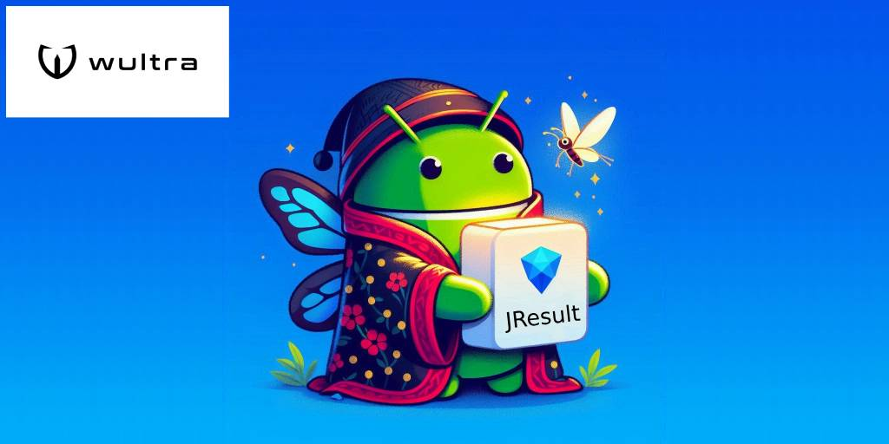

# Wultra JResult

<p align="center"></p>

[]
[](https://mvnrepository.com/artifact/com.wultra.android.mtokensdk/wultra-mtoken-sdk)

[](LICENSE)

A Java-enabled wrapper for the kotlin.Result class which is unable to bridge into the Java.

## Integration

Add dependency to your Gradle project.

```groovy
dependencies {
    implementation("com.wultra.android.utilities:jresult:1.0.0")
}
```

## Example usage

Imagine having a 3rd party service that is providing a list of users asynchronously with Result-like based API, that returns kotlin.Result object via lambda function you provided

```java
myService.fetchUsers( result -> {
    new JResult<List<User>>(result)
        .onFailure( exception -> {
            // failed to retrieve the list
            // process exception
            return null;
        })
        .onSuccess( users -> {
             // process users of List<User> type
             return null
        });
    return null; // end of fetchUsers
});
```